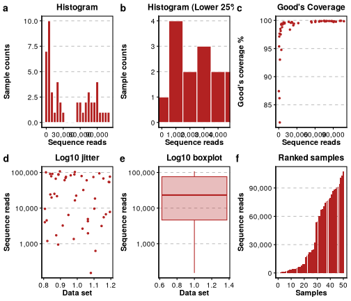

<style type="text/css">
.note {
  background-color: #e7f3fe;
  border-left: 6px solid #2196F3;
  padding: 10px;
  margin: 15px 0;
}
</style>

# Load R libraries


``` r
library(BRCore)

if (requireNamespace("phyloseq", quietly = TRUE)) {
  library(phyloseq)
} else {
  message("Package 'phyloseq' not installed; some examples will be skipped.")
}

if (requireNamespace("tidyverse", quietly = TRUE)) {
  library(tidyverse)
} else {
  message(
    "Package 'tidyverse' not installed; some code chunks will be skipped or use base R."
  )
}
#> ── Attaching core tidyverse packages ───────────────────────────────────────────────── tidyverse 2.0.0 ──
#> ✔ dplyr     1.1.4     ✔ readr     2.1.5
#> ✔ forcats   1.0.0     ✔ stringr   1.6.0
#> ✔ lubridate 1.9.4     ✔ tibble    3.3.0
#> ✔ purrr     1.2.0     ✔ tidyr     1.3.1
#> ── Conflicts ─────────────────────────────────────────────────────────────────── tidyverse_conflicts() ──
#> ✖ readr::edition_get()   masks testthat::edition_get()
#> ✖ dplyr::filter()        masks BRCore::filter(), stats::filter()
#> ✖ purrr::is_null()       masks testthat::is_null()
#> ✖ dplyr::lag()           masks stats::lag()
#> ✖ readr::local_edition() masks testthat::local_edition()
#> ✖ dplyr::matches()       masks tidyr::matches(), testthat::matches()
#> ℹ Use the ]8;;http://conflicted.r-lib.org/conflicted package]8;; to force all conflicts to become errors

if (requireNamespace("viridis", quietly = TRUE)) {
  library(viridis)
} else {
  message(
    "Package 'viridis' not installed; some code chunks will be skipped or use base R."
  )
}
```

The `BRCore` R package comes with a few datasets. Three 16S datasets: `switchgrass`, 
`mimulus`, and `bean`, from @Shade2019Abundance; a 16S dataset, called `bcse`, from leaves 
of ten different cropping systems in the Bioenergy Crop Research Experiment 
from @Haan2023Contrasting. Here we are going to use `bcse` since it is not rarefied 
in contrast of the other three.


``` r
data("bcse", package = "BRCore")
str(bcse)
#> Formal class 'phyloseq' [package "phyloseq"] with 5 slots
#>   ..@ otu_table:Formal class 'otu_table' [package "phyloseq"] with 2 slots
#>   .. .. ..@ .Data        : int [1:2861, 1:50] 0 1 0 0 27777 0 7 2 119 0 ...
#>   .. .. .. ..- attr(*, "dimnames")=List of 2
#>   .. .. .. .. ..$ : chr [1:2861] "OTU_427" "OTU_11" "OTU_253" "OTU_148" ...
#>   .. .. .. .. ..$ : chr [1:50] "bcse50" "bcse69" "bcse73" "bcse191" ...
#>   .. .. ..@ taxa_are_rows: logi TRUE
#>   .. .. ..$ dim     : int [1:2] 2861 50
#>   .. .. ..$ dimnames:List of 2
#>   .. .. .. ..$ : chr [1:2861] "OTU_427" "OTU_11" "OTU_253" "OTU_148" ...
#>   .. .. .. ..$ : chr [1:50] "bcse50" "bcse69" "bcse73" "bcse191" ...
#>   ..@ tax_table:Formal class 'taxonomyTable' [package "phyloseq"] with 1 slot
#>   .. .. ..@ .Data: chr [1:2861, 1:10] "OTU_427" "OTU_11" "OTU_253" "OTU_148" ...
#>   .. .. .. ..- attr(*, "dimnames")=List of 2
#>   .. .. .. .. ..$ : chr [1:2861] "OTU_427" "OTU_11" "OTU_253" "OTU_148" ...
#>   .. .. .. .. ..$ : chr [1:10] "OTU_ID" "Kingdom" "Phylum" "Class" ...
#>   .. .. ..$ dim     : int [1:2] 2861 10
#>   .. .. ..$ dimnames:List of 2
#>   .. .. .. ..$ : chr [1:2861] "OTU_427" "OTU_11" "OTU_253" "OTU_148" ...
#>   .. .. .. ..$ : chr [1:10] "OTU_ID" "Kingdom" "Phylum" "Class" ...
#>   ..@ sam_data :'data.frame':	50 obs. of  3 variables:
#> Formal class 'sample_data' [package "phyloseq"] with 4 slots
#>   .. .. ..@ .Data    :List of 3
#>   .. .. .. ..$ : chr [1:50] "Leaf" "Leaf" "Leaf" "Leaf" ...
#>   .. .. .. ..$ : chr [1:50] "Corn" "Sorghum" "Switchgrass" "Miscanthus" ...
#>   .. .. .. ..$ : chr [1:50] "R2" "R4" "R5" "R5" ...
#>   .. .. ..@ names    : chr [1:3] "Niche" "Crop" "Plot"
#>   .. .. ..@ row.names: chr [1:50] "bcse50" "bcse69" "bcse73" "bcse191" ...
#>   .. .. ..@ .S3Class : chr "data.frame"
#>   ..@ phy_tree : NULL
#>   ..@ refseq   :Formal class 'DNAStringSet' [package "Biostrings"] with 5 slots
#>   .. .. ..@ pool           :Formal class 'SharedRaw_Pool' [package "XVector"] with 2 slots
#>   .. .. .. .. ..@ xp_list                    :List of 1
#>   .. .. .. .. .. ..$ :<externalptr> 
#>   .. .. .. .. ..@ .link_to_cached_object_list:List of 1
#>   .. .. .. .. .. ..$ :<environment: 0x5a8b28f7eee0> 
#>   .. .. ..@ ranges         :Formal class 'GroupedIRanges' [package "XVector"] with 7 slots
#>   .. .. .. .. ..@ group          : int [1:2861] 1 1 1 1 1 1 1 1 1 1 ...
#>   .. .. .. .. ..@ start          : int [1:2861] 106501 2501 63001 36751 501 19251 14251 37751 3751 8501 ...
#>   .. .. .. .. ..@ width          : int [1:2861] 250 250 250 250 250 250 250 250 250 250 ...
#>   .. .. .. .. ..@ NAMES          : chr [1:2861] "OTU_427" "OTU_11" "OTU_253" "OTU_148" ...
#>   .. .. .. .. ..@ elementType    : chr "ANY"
#>   .. .. .. .. ..@ elementMetadata: NULL
#>   .. .. .. .. ..@ metadata       : list()
#>   .. .. ..@ elementType    : chr "DNAString"
#>   .. .. ..@ elementMetadata: NULL
#>   .. .. ..@ metadata       : list()
```

# Preprocessing

We are not going to talk about the importance of rarefaction as it is not the goal
of this vignette, but if you are interested you should read @Schloss2024Rarefaction, 
@Schloss2024Waste, @Hong2022Rarefy, and @Weiss2017Normalization as a start.

In `BRCore`, to identified the ideal rarefaction cutoff we can plot a simple series 
of visuals to guide us in the decision. As we all know, we can estimate how well
a DNA sample will sequence, but there are always some samples that fail to sequence 
(or sequence badly) and some others that will sequence "too well" for reasons that 
are outside our control or by chance.

In the end we will need to decide how many samples we are accepting to discard and
how much diversity we want to retain. To do that we can use some help form these plots
below.


``` r
bcse_metrics <- add_rarefaction_metrics(data = bcse)
bcse_metrics
#> phyloseq-class experiment-level object
#> otu_table()   OTU Table:         [ 2861 taxa and 50 samples ]
#> sample_data() Sample Data:       [ 50 samples by 7 sample variables ]
#> tax_table()   Taxonomy Table:    [ 2861 taxa by 10 taxonomic ranks ]
#> refseq()      DNAStringSet:      [ 2861 reference sequences ]
```


``` r
rarefaction_plot <- plot_rarefaction_metrics(bcse_metrics)
#> ℹ Processing 50 samples
#> 
ℹ Generating rarefaction diagnostic plots

                                         
✔ Rarefaction diagnostic plots generated successfully
#> ℹ Generating rarefaction diagnostic plots

✔ Generating rarefaction diagnostic plots [797ms]
print(rarefaction_plot)
```



**Figure 1** Rarefaction metrics. a-b, histograms of samples. c, Good's coverage per
total number of sequences in a sample. d-e, log10 of sequences in a sample. f, 
samples ranked by sequence reads in a sample.

<div class="note">
**Note:** The Good's coverage" is a statistics used in ecology that estimates the proportion
of species in a community that are represented in a sample, based on the number of 
species encountered and the total number of individuals sampled. Essentially, it 
quantifies how well a sample represents the overall diversity of a population or 
ecosystem. Good's coverage is calculated as \(1-(n1/N)\), where \(n1\) is the number
of unique ASV/OTUs (i.e. species) found only once, and \(N\) is the total number of 
sequence reads (i.e. individuals); a high percentage (e.g., >95%) means most reads
are from common taxa, suggesting sufficient sampling, while low coverage indicates 
many rare, potentially missed, taxa. 
</div>

# Perform mutiple rarefaction

The best way to rarefy your data is to use the multiple rarefaction approach. Originally
developed by Sanders in 1968 it has been adopted widely in ecology research. 


``` r
bcse_rarefied_list <-
  multi_rarefy(
    physeq_obj = bcse,
    depth_level = 1000,
    num_iter = 100,
    threads = 8,
    set_seed = 7642
  )
#> Error in multi_rarefy(physeq_obj = bcse, depth_level = 1000, num_iter = 100, : unused argument (threads = 8)
```bcse_rarefied_list
bcse_rarefied_list
bcse_rarefied_listat everything looks good before going further.
bcse_rarefied_list

``` r
rowSums(bcse_rarefied_list)
#> Error: object 'bcse_rarefied_list' not found
bcse_rarefied_list[1:10, 1:10]
#> Error: object 'bcse_rarefied_list' not found
```

### Recreate a phyloseq object with rarefied `otu_table()` 

We can then use the `do_phyloseq()` function to replace the `otu_table()` with the 
rarefied table you just created. Or, you can creabcse_rarefied_listarefied table
calculated before.bcse_rarefied_list


``` r
bcse_rare <-
  update_otu_table(physeq_obj = bcse, otu_rare = bcse_rarefied_list)
#> Error: object 'bcse_rarefied_list' not found

print(bcse_rare)
#> Error: object 'bcse_rare' not found
sample_sums(bcse_rare)
#> Error in h(simpleError(msg, call)): error in evaluating the argument 'object' in selecting a method for function 'otu_table': object 'bcse_rare' not found
```

# Core analysis

### Identify the core ASV/OTUs set

We can now identify how many core ASV/OTUs are present in our dataset across a 
variable we want to use to calculate the core, in this case is "Crop". The resulted
object will contain several metrics for the core set of ASV/OTUs calculated across
the variable `Crop`.


``` r
bcse_rare_core <- identify_core(
  physeq_obj = bcse_rare,
  priority_var = "Crop",
  increase_value = 0.02,
  abundance_weight = 0,
  seed = 2134
)
#> Seed used: 2134
#> Error: object 'bcse_rare' not found
```

### *How the is the core identified?*

As shown by @Shade2019Abundance, an interesting way explore the abundance and 
occupancy inclusion thresholds used to define the core microbiome is to evaluate how 
well the resulting core membership captures the overarching patterns of beta 
diversity found in the complete dataset. This approach treats the core microbiome
as a representative subset that should preserve the main ecological relationships 
and sample-to-sample differences observed when using all taxa. By measuring how 
closely the beta diversity patterns calculated from core taxa alone match those 
from the full dataset, researchers can objectively assess whether their chosen 
thresholds produce a meaningful and informative core that maintains the essential 
structural information of the microbial community while reducing complexity.

To identify the optimal point where increasing the core inclusion threshold provides
diminishing returns in explanatory value, we offer two automated methods. 

* The first is a more stringent `elbow` approach that finds the bend in the 
abundance-occupancy curve where adding more taxa yields progressively smaller 
improvements. This method calculates the first-order difference (numerical 
differentiation) by assigning a score to each potential cutoff point, splitting
the curve into two parts, and finding the point that maximizes the difference 
in average rates of change between these parts. 

* The second method uses a final percent `increase` threshold in beta-diversity 
(we recommend 2% or more), which continues adding taxa until improvements fall 
below this percentage. 

Both methods measure improvement using Bray-Curtis similarity through the 
equation `C = 1 - (BC_core/BC_all)`, where `C` represents the contribution of 
ranked taxa to total similarity, `BC_core` is the Bray-Curtis similarity using 
only core taxa, and `BC_all` uses the complete dataset. 

The cumulative explanatory value of adding each next-ranked taxon can be plotted
using the plot_bc_increase function, with the red line indicating the elbow 
method cutoff and colored lines showing the 2% threshold cutoff. These approaches
eliminate the need for subjective threshold setting by automatically identifying
natural breakpoints where additional taxa provide marginal returns in explanatory
power.

The output is a list of 13 named items.


``` r
str(bcse_rare_core)
#> Error: object 'bcse_rare_core' not found
```

### Visualize the abundance-occupancy distribution and the core ASV/OTUs set

As you can see, all the objects needed for the plot were outputted in the list 
obtained from `identify_core()`


``` r
bcse_identified_core <- plot_identified_core(
  bray_curtis_ranked = bcse_rare_core$bray_curtis_ranked,
  elbow = bcse_rare_core$elbow,
  lastCall = bcse_rare_core$bc_increase,
  increase_value = bcse_rare_core$increase_value
)
#> Error: object 'bcse_rare_core' not found
```


``` r
print(bcse_identified_core)
#> Error: object 'bcse_identified_core' not found
```

**Figure 2** Percent Bray-Curtis similarity between samples per ranked ASV/OTUs. 

### Visualize the abundance-occupancy curve 

We can also then have a quick look about how abundance and how frequent the identified
core set is compare to all other taxa in the community using the last 2% increase 
in Bray-Curtis similarity of the ranked ASV/OTUs.


``` r
plot_abund_occ_increase <- plot_abundance_occupancy(
  core_result = bcse_rare_core,
  core_set = "increase"
)
#> Error: object 'bcse_rare_core' not found
```


``` r
print(plot_abund_occ_increase)
#> Error: object 'plot_abund_occ_increase' not found
```

**Figure 3** Abundance-occupancy distribution and last 2% increase core set. 

We can also visualize the core set detected with the `elbow` method.


``` r
plot_abund_occ_elbow <- plot_abundance_occupancy(
  core_result = bcse_rare_core,
  core_set = "elbow"
)
#> Error: object 'bcse_rare_core' not found
```


``` r
plot_abund_occ_elbow +
  scale_fill_manual(values = c("darkgreen", "grey"))
#> Error: object 'plot_abund_occ_elbow' not found
```

**Figure 4** Abundance-occupancy distribution and last elbow core set. 

### Visualize the core set across the variable used for detecting the core

This can be achieved using the `plot_core_distribution()` function.
Three visualization methods are implemented. Using the `plot_type` argument, you 
can switch between a bar plot, a line plot or heatmap. Each visualization has 
its advantages and disadvantages depending on how many levels the variable used 
for detecting the core has. For example, for up to 5 levels I would use bar or 
line plot, otherwise I would use heatmaps. This is subjective and you can 
build your own plotting function since you have all the data you need 
in `bcse_rare_core`.

See the different figures below:


``` r
plot_core_dist_bar <- plot_core_distribution(
  core_result = bcse_rare_core,
  core_set = "increase",
  group_var = "Crop",
  plot_type = "bar"
)
#> Error: object 'bcse_rare_core' not found
```


``` r
print(plot_core_dist_bar)
#> Error: object 'plot_core_dist_bar' not found
```

**Figure 5** A bar plot won't work here, way too many variable levels.


``` r
plot_core_dist_line <- plot_core_distribution(
  core_result = bcse_rare_core,
  core_set = "increase",
  group_var = "Crop",
  plot_type = "line"
)
#> Error: object 'bcse_rare_core' not found
```


``` r
print(plot_core_dist_line)
#> Error: object 'plot_core_dist_line' not found
```

**Figure 6** A line plot may be a little better.


``` r
bcse_rare_core$metadata <- bcse_rare_core$metadata %>%
  mutate(
    Crop = recode(
      Crop,
      "Corn" = "Corn",
      "Sorghum" = "Sorghum",
      "Continuous Sorghum" = "Sorghum + cover crop",
      "Miscanthus" = "Miscanthus",
      "New Switchgrass" = "Establishing switchgrass",
      "Switchgrass" = "Mature switchgrass",
      "Early Succession" = "Successional vegetation",
      "Native Grasses" = "Native grass mix",
      "Prairie" = "Reconstructed prairie",
      "Poplar" = "Poplar"
    ),
    Crop = factor(
      Crop,
      levels = c(
        "Corn",
        "Sorghum",
        "Sorghum + cover crop",
        "Miscanthus",
        "Establishing switchgrass",
        "Mature switchgrass",
        "Successional vegetation",
        "Native grass mix",
        "Reconstructed prairie",
        "Poplar"
      )
    )
  )
#> Error: object 'bcse_rare_core' not found
```


``` r
plot_core_dist_heatmap <- plot_core_distribution(
  core_result = bcse_rare_core,
  core_set = "increase",
  group_var = "Crop",
  plot_type = "heatmap"
) +
  viridis::scale_fill_viridis(option = "plasma", name = "Occupancy")
#> Error: object 'bcse_rare_core' not found
```


``` r
print(plot_core_dist_heatmap)
#> Error: object 'plot_core_dist_heatmap' not found
```

**Figure 7** A heatmap, is definitely more compact and shows well enough the average 
occupancy across samples in each variable level.

# Fitting Neutral Model 

In ecology and evolution a neutral model is a model that generate patterns assuming 
random chance and functional equivalence among species (ASV/OTUs) or individuals 
rather than specific deterministic factors, for example, selection or niches 
(There is a vast literature about this, that we can not cover here). 
In practice, neutral models are a specific case of Null models [@Gotelli2006Null] 
and the act as null hypotheses to test if observed real-world patterns (e.g., species abundance, 
genetic diversity) significantly deviate from what random processes would predict,
and can help scientists to identify the influence of actual ecological or 
evolutionary forces. 

The work of @Sloan2006Quantifying and @Burns2015Contribution were among the first to 
apply these type of models to microbiome data. In `BRCore`, we implemented user 
friendly functions to fit and visualize neutral models in microbiome data, without 
compromising the original conceptual or mathematical framework developed by 
the abovementioned authors.

First, we fit the neutral model 


``` r
bcse_rare_core_neutral_fit <- fit_neutral_model(
  otu_table = bcse_rare_core$otu_table,
  core_set = bcse_rare_core$increase_core,
  abundance_occupancy = bcse_rare_core$abundance_occupancy
)
#> Error: object 'bcse_rare_core' not found
```

What we get is


``` r
str(bcse_rare_core_neutral_fit)
#> Error: object 'bcse_rare_core_neutral_fit' not found
```

### Plot the neutral model and the core set 


``` r
plot_bcse_neutral_fit <- plot_neutral_model(bcse_rare_core_neutral_fit)
#> Error: object 'bcse_rare_core_neutral_fit' not found
```


``` r
print(plot_bcse_neutral_fit)
#> Error: object 'plot_bcse_neutral_fit' not found
```

**Figure 8** Neutral model of abundance-occupancy distributions for the `bcse` 
dataset. *R*^2^ is a standard r-square statistics of goodness of fit
(*R*^2^ = 1 − SS~err~/SS~total~) while *m* is the immigration parameter and 
represents the probability that a given individual in a sample originated from 
the meta community rather than from the local community.

In Figure 8 we can see that the neutral model does not fit well: the *R*^2^ is 
quite low, and we can visually see that most of the ASV/OTUs (not just the core, 
all taxa are considered here) are above the model prediction. Additionally, the 
estimated immigration paramater m = 0.63 tells that strong mixing from the 
meta community occur, the local community is dominated by immigration.

<div class="note">
**Note:** 
As a rule of thumb, when: 
As a rule of thumb, the migration parameter (<em>m</em>) can be interpreted as follows:  
<ul>
  <li><strong>Very low</strong> (<em>m</em> ≈ 0–0.05): strong dispersal limitation; 
  local history dominates community assembly.</li>
  <li><strong>Moderate</strong> (<em>m</em> ≈ 0.1–0.3): partial connectivity among 
  sites; both dispersal and local structure influence community composition.</li>
  <li><strong>High</strong> (<em>m</em> ≥ 0.4, as in our case): high dispersal 
  rates and strong mixing from the regional source pool.</li>
</ul>
</div>

# Session info

``` r
sessionInfo()
#> R version 4.5.2 (2025-10-31)
#> Platform: x86_64-pc-linux-gnu
#> Running under: Arch Linux
#> 
#> Matrix products: default
#> BLAS/LAPACK: /usr/lib/libopenblas.so.0.3;  LAPACK version 3.12.0
#> 
#> locale:
#>  [1] LC_CTYPE=C.UTF-8       LC_NUMERIC=C           LC_TIME=C.UTF-8        LC_COLLATE=C.UTF-8    
#>  [5] LC_MONETARY=C.UTF-8    LC_MESSAGES=C.UTF-8    LC_PAPER=C.UTF-8       LC_NAME=C             
#>  [9] LC_ADDRESS=C           LC_TELEPHONE=C         LC_MEASUREMENT=C.UTF-8 LC_IDENTIFICATION=C   
#> 
#> time zone: America/Chicago
#> tzcode source: system (glibc)
#> 
#> attached base packages:
#> [1] stats     graphics  grDevices utils     datasets  methods   base     
#> 
#> other attached packages:
#>  [1] lubridate_1.9.4   forcats_1.0.0     stringr_1.6.0     dplyr_1.1.4       purrr_1.2.0      
#>  [6] readr_2.1.5       tidyr_1.3.1       tibble_3.3.0      tidyverse_2.0.0   here_1.0.1       
#> [11] knitr_1.50        BRCore_1.0.2      ggplot2_4.0.1     viridis_0.6.5     viridisLite_0.4.2
#> [16] phyloseq_1.54.0   testthat_3.2.3    devtools_2.4.5    usethis_3.1.0    
#> 
#> loaded via a namespace (and not attached):
#>   [1] RColorBrewer_1.1-3  rstudioapi_0.17.1   jsonlite_2.0.0      magrittr_2.0.4      farver_2.1.2       
#>   [6] rmarkdown_2.30      fs_1.6.6            ragg_1.5.2          vctrs_0.6.5         multtest_2.66.0    
#>  [11] memoise_2.0.1       base64enc_0.1-3     rstatix_0.7.3       htmltools_0.5.9     broom_1.0.11       
#>  [16] Rhdf5lib_1.32.0     Formula_1.2-5       rhdf5_2.54.1        parallelly_1.45.1   htmlwidgets_1.6.4  
#>  [21] desc_1.4.3          plyr_1.8.9          cachem_1.1.0        commonmark_1.9.2    whisker_0.4.1      
#>  [26] igraph_2.2.1        mime_0.13           lifecycle_1.0.4     minpack.lm_1.2-4    iterators_1.0.14   
#>  [31] pkgconfig_2.0.3     Matrix_1.7-2        R6_2.6.1            fastmap_1.2.0       shiny_1.10.0       
#>  [36] digest_0.6.39       colorspace_2.1-2    S4Vectors_0.48.0    rprojroot_2.0.4     pkgload_1.4.0      
#>  [41] textshaping_1.0.0   Hmisc_5.2-4         ggpubr_0.6.2        vegan_2.7-2         labeling_0.4.3     
#>  [46] timechange_0.3.0    abind_1.4-8         mgcv_1.9-4          compiler_4.5.2      remotes_2.5.0      
#>  [51] withr_3.0.2         htmlTable_2.4.3     S7_0.2.1            backports_1.5.0     carData_3.0-5      
#>  [56] pkgbuild_1.4.6      ggsignif_0.6.4      MASS_7.3-64         sessioninfo_1.2.3   biomformat_1.38.0  
#>  [61] ggsci_4.1.0         permute_0.9-8       tools_4.5.2         foreign_0.8-88      ape_5.8-1          
#>  [66] httpuv_1.6.15       nnet_7.3-20         glue_1.8.0          nlme_3.1-167        rhdf5filters_1.22.0
#>  [71] promises_1.3.2      grid_4.5.2          checkmate_2.3.3     cluster_2.1.8       reshape2_1.4.5     
#>  [76] ade4_1.7-23         generics_0.1.4      diffobj_0.3.5       gtable_0.3.6        tzdb_0.4.0         
#>  [81] hms_1.1.3           data.table_1.17.8   xml2_1.3.6          car_3.1-3           XVector_0.50.0     
#>  [86] BiocGenerics_0.56.0 ggrepel_0.9.6       foreach_1.5.2       pillar_1.11.1       later_1.4.1        
#>  [91] splines_4.5.2       lattice_0.22-7      survival_3.8-3      tidyselect_1.2.1    Biostrings_2.78.0  
#>  [96] miniUI_0.1.1.1      gridExtra_2.3       IRanges_2.44.0      Seqinfo_1.0.0       stats4_4.5.2       
#> [101] xfun_0.54           Biobase_2.70.0      brio_1.1.5          stringi_1.8.7       evaluate_1.0.5     
#> [106] codetools_0.2-20    cli_3.6.5           rpart_4.1.24        xtable_1.8-4        systemfonts_1.2.1  
#> [111] roxygen2_7.3.3      Rcpp_1.1.0          parallel_4.5.2      ellipsis_0.3.2      profvis_0.4.0      
#> [116] urlchecker_1.0.1    scales_1.4.0        crayon_1.5.3        rlang_1.1.6         cowplot_1.2.0      
#> [121] waldo_0.6.1
```

# References
